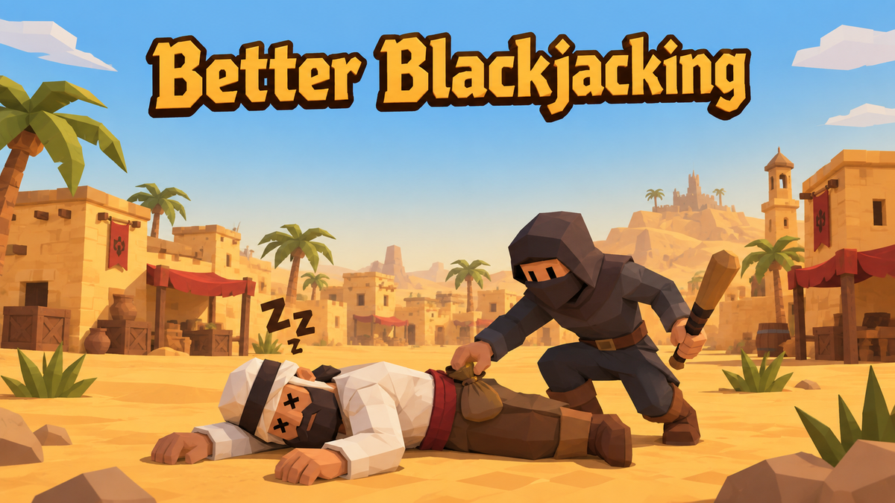

  

<h1 align="center">Better Blackjacking</h1>

Better Blackjacking is a RuneLite plugin for blackjacking bandits and Menaphite thugs in Pollnivneach. With a blackjack equipped, it outlines your target's click box in a colour that tells you what to do next — pickpocket, get ready, knock out, or break combat — shows a smooth countdown to the next knock-out, times the two guaranteed pickpockets with a pair of pips, and can play a get-up animation when the target wakes instead of letting it snap to its feet. It only draws on screen: it never clicks, swaps menus or changes your input.

## Links

- [Report a bug](https://github.com/Oveduumnakal/Better-Blackjacking-Plugin/issues/new?template=bug_report.yml)
- [Request a feature](https://github.com/Oveduumnakal/Better-Blackjacking-Plugin/issues/new?template=feature_request.yml)
- [Buy me a coffee](https://buymeacoffee.com/oveduumnakal)
